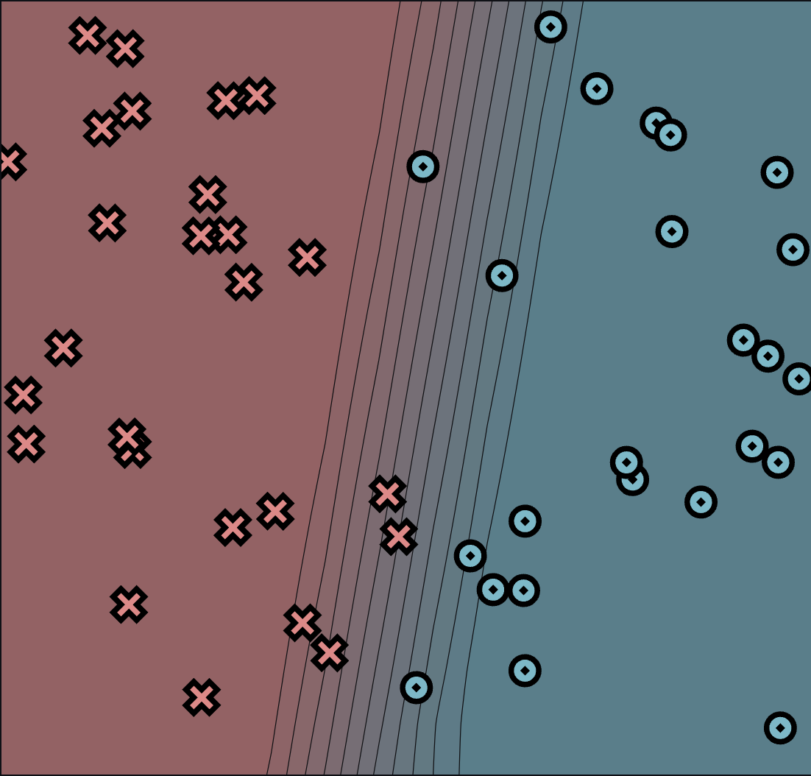
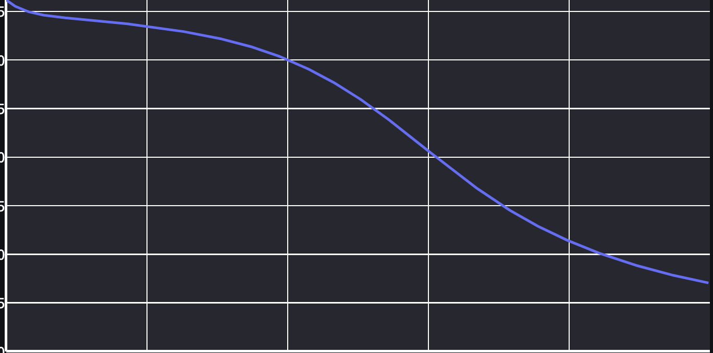
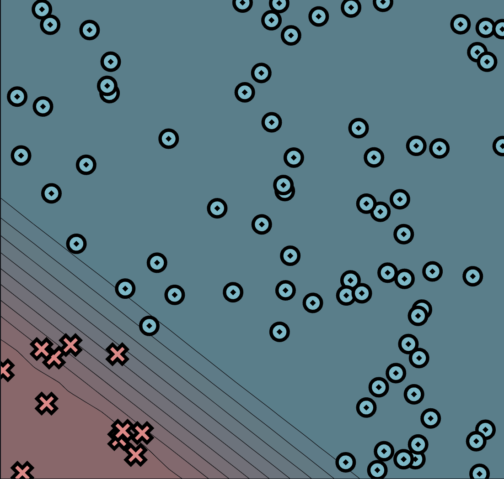
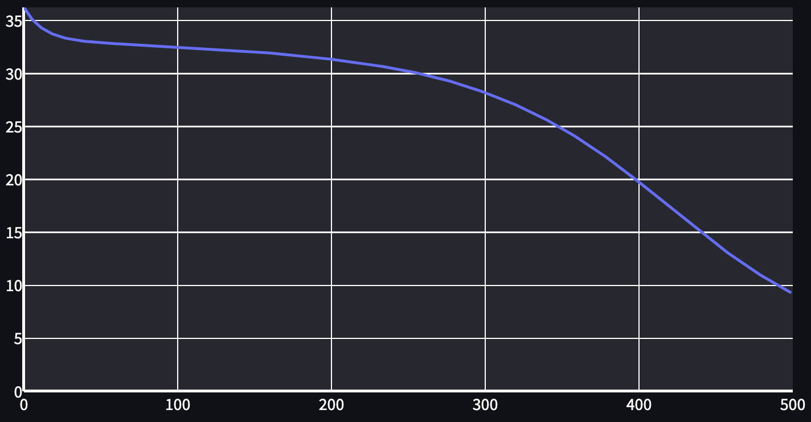
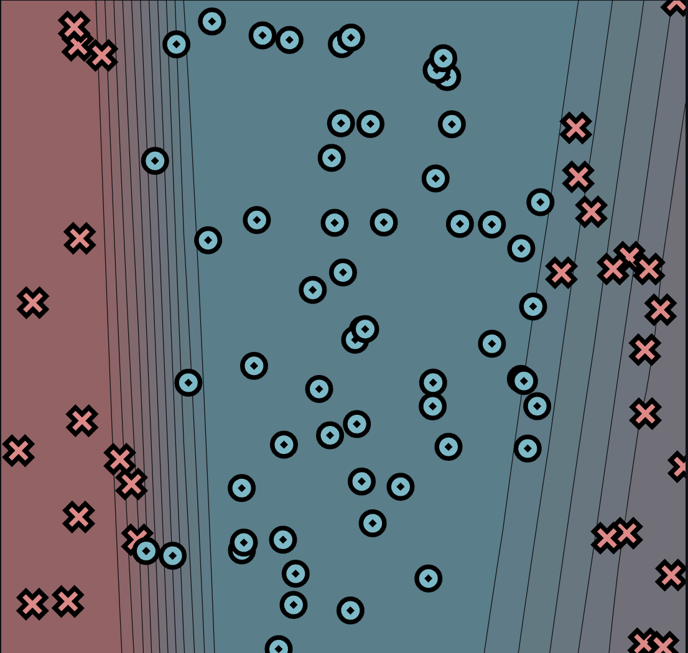
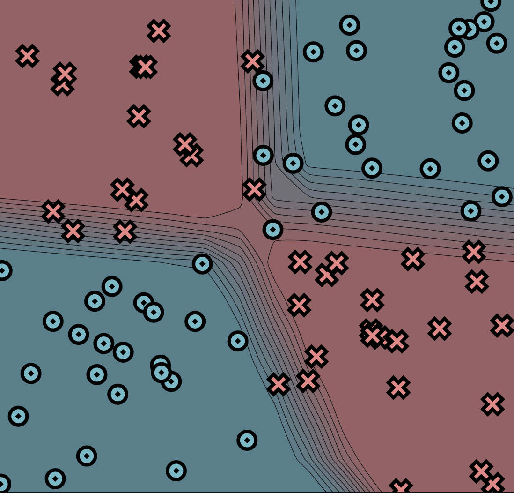
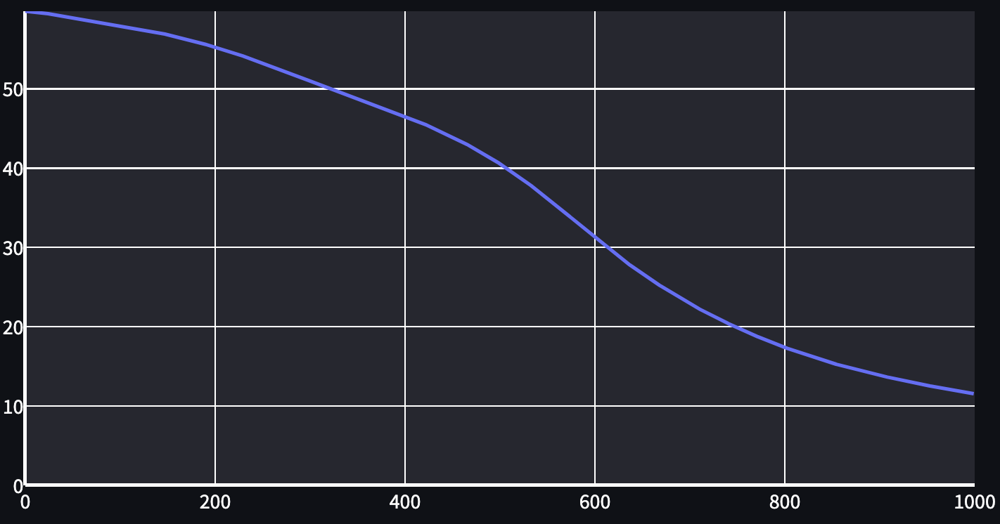

[](https://classroom.github.com/a/YFgwt0yY)
# MiniTorch Module 2


* Docs: https://minitorch.github.io/

* Overview: https://minitorch.github.io/module2/module2/

This assignment requires the following files from the previous assignments. You can get these by running

```bash
python sync_previous_module.py previous-module-dir current-module-dir
```

The files that will be synced are:

        minitorch/operators.py minitorch/module.py minitorch/autodiff.py minitorch/scalar.py minitorch/scalar_functions.py minitorch/module.py project/run_manual.py project/run_scalar.py project/datasets.py

# Training results:

## Simple:
Epoch 500/500. Time per epoch: 0.033s. Time left: 0.00s.
Number of of points: 50
Hidden layers: 2
Learning rate: 0.1
Epochs: 500



```
Epoch: 10/500, loss: 35.34604821977737, correct: 24
Epoch: 20/500, loss: 34.84522522205385, correct: 24
Epoch: 30/500, loss: 34.56353072194201, correct: 25
Epoch: 40/500, loss: 34.386611658573266, correct: 29
Epoch: 50/500, loss: 34.25632584832798, correct: 28
Epoch: 60/500, loss: 34.1410686267913, correct: 29
Epoch: 70/500, loss: 34.006025667023664, correct: 30
Epoch: 80/500, loss: 33.84962502330299, correct: 30
Epoch: 90/500, loss: 33.67124158736854, correct: 31
Epoch: 100/500, loss: 33.49474927151448, correct: 32
Epoch: 110/500, loss: 33.30408619348285, correct: 33
Epoch: 120/500, loss: 33.09001044224119, correct: 34
Epoch: 130/500, loss: 32.85215379838169, correct: 34
Epoch: 140/500, loss: 32.58736933871028, correct: 34
Epoch: 150/500, loss: 32.291906331168526, correct: 34
Epoch: 160/500, loss: 31.956899693028053, correct: 36
Epoch: 170/500, loss: 31.57571596474508, correct: 36
Epoch: 180/500, loss: 31.141523642126977, correct: 36
Epoch: 190/500, loss: 30.64756692633237, correct: 36
Epoch: 200/500, loss: 30.088104178358886, correct: 37
Epoch: 210/500, loss: 29.460695493070578, correct: 38
Epoch: 220/500, loss: 28.758567479879325, correct: 39
Epoch: 230/500, loss: 27.98399443284319, correct: 39
Epoch: 240/500, loss: 27.136240072863345, correct: 39
Epoch: 250/500, loss: 26.21317710282803, correct: 39
Epoch: 260/500, loss: 25.218453940560938, correct: 41
Epoch: 270/500, loss: 24.16100517990526, correct: 41
Epoch: 280/500, loss: 23.054513522345417, correct: 42
Epoch: 290/500, loss: 21.914324501632542, correct: 42
Epoch: 300/500, loss: 20.748776695107676, correct: 43
Epoch: 310/500, loss: 19.60173340923356, correct: 43
Epoch: 320/500, loss: 18.46829885324361, correct: 43
Epoch: 330/500, loss: 17.368229371710736, correct: 44
Epoch: 340/500, loss: 16.335229154003503, correct: 44
Epoch: 350/500, loss: 15.35174572034388, correct: 45
Epoch: 360/500, loss: 14.43299706553829, correct: 45
Epoch: 370/500, loss: 13.58861990365928, correct: 45
Epoch: 380/500, loss: 12.8065472946382, correct: 45
Epoch: 390/500, loss: 12.088121313823486, correct: 46
Epoch: 400/500, loss: 11.425261257174816, correct: 46
Epoch: 410/500, loss: 10.814173895461668, correct: 46
Epoch: 420/500, loss: 10.246158494252418, correct: 46
Epoch: 430/500, loss: 9.726258892646404, correct: 46
Epoch: 440/500, loss: 9.245057095547294, correct: 47
Epoch: 450/500, loss: 8.800165180897645, correct: 47
Epoch: 460/500, loss: 8.389177613940248, correct: 47
Epoch: 470/500, loss: 8.012516821244438, correct: 47
Epoch: 480/500, loss: 7.665070778815295, correct: 47
Epoch: 490/500, loss: 7.346559415257833, correct: 47
Epoch: 500/500, loss: 7.051772230153775, correct: 47
```

## Diag:
Epoch 270/500. Time per epoch: 0.048s. Time left: 11.09s.
Number of of points: 87
Hidden layers: 2
Learning rate: 0.1
Epochs: 500



```
Epoch: 10/500, loss: 34.60056004704817, correct: 76
Epoch: 20/500, loss: 33.712906011966, correct: 76
Epoch: 30/500, loss: 33.28189974571462, correct: 76
Epoch: 40/500, loss: 33.054365254957105, correct: 76
Epoch: 50/500, loss: 32.91926894158637, correct: 76
Epoch: 60/500, loss: 32.824387137729985, correct: 76
Epoch: 70/500, loss: 32.746825254573274, correct: 76
Epoch: 80/500, loss: 32.67493472318221, correct: 76
Epoch: 90/500, loss: 32.60421844474951, correct: 76
Epoch: 100/500, loss: 32.53106167797055, correct: 76
Epoch: 110/500, loss: 32.45309837249063, correct: 76
Epoch: 120/500, loss: 32.36887743068041, correct: 76
Epoch: 130/500, loss: 32.27733516201601, correct: 76
Epoch: 140/500, loss: 32.177461405321985, correct: 76
Epoch: 150/500, loss: 32.07044737478358, correct: 76
Epoch: 160/500, loss: 31.95268939019877, correct: 76
Epoch: 170/500, loss: 31.825028150397408, correct: 76
Epoch: 180/500, loss: 31.685468539532216, correct: 76
Epoch: 190/500, loss: 31.533452009651405, correct: 76
Epoch: 200/500, loss: 31.36889480615337, correct: 76
Epoch: 210/500, loss: 31.18700928798508, correct: 76
Epoch: 220/500, loss: 30.987507803354866, correct: 76
Epoch: 230/500, loss: 30.768554285532673, correct: 76
Epoch: 240/500, loss: 30.526691007125383, correct: 76
Epoch: 250/500, loss: 30.252522025747634, correct: 76
Epoch: 260/500, loss: 29.946808143912502, correct: 76
Epoch: 270/500, loss: 29.597464600476286, correct: 76
Epoch: 280/500, loss: 29.198068266085134, correct: 76
Epoch: 290/500, loss: 28.748239415710362, correct: 76
Epoch: 300/500, loss: 28.249338145316038, correct: 76
Epoch: 310/500, loss: 27.700421980917415, correct: 76
Epoch: 320/500, loss: 27.097051562317763, correct: 76
Epoch: 330/500, loss: 26.43219722828623, correct: 76
Epoch: 340/500, loss: 25.700259662010513, correct: 76
Epoch: 350/500, loss: 24.899095997788937, correct: 76
Epoch: 360/500, loss: 24.02846808008014, correct: 76
Epoch: 370/500, loss: 23.085293764096726, correct: 76
Epoch: 380/500, loss: 22.075923945687247, correct: 76
Epoch: 390/500, loss: 20.999566069212605, correct: 76
Epoch: 400/500, loss: 19.865958451138958, correct: 76
Epoch: 410/500, loss: 18.68374315632465, correct: 76
Epoch: 420/500, loss: 17.498458204239757, correct: 76
Epoch: 430/500, loss: 16.31103710049031, correct: 76
Epoch: 440/500, loss: 15.131819339208874, correct: 76
Epoch: 450/500, loss: 14.01433933313018, correct: 76
Epoch: 460/500, loss: 12.943697251445746, correct: 81
Epoch: 470/500, loss: 11.928674545413953, correct: 82
Epoch: 480/500, loss: 10.979635906819853, correct: 83
Epoch: 490/500, loss: 10.102195265040912, correct: 85
Epoch: 500/500, loss: 9.301074909551614, correct: 85
```

## Split:
Epoch 1000/1000. Time per epoch: 0.079s. Time left: 0.00s.
Number of of points: 87
Hidden layers: 3
Learning rate: 0.1
Epochs: 1000



```
Epoch: 10/1000, loss: 57.81674073583263, correct: 57
Epoch: 20/1000, loss: 56.85755728437203, correct: 57
Epoch: 30/1000, loss: 56.26766610589665, correct: 57
Epoch: 40/1000, loss: 55.97194575515451, correct: 57
Epoch: 50/1000, loss: 55.8158110700443, correct: 57
Epoch: 60/1000, loss: 55.71971265073292, correct: 57
Epoch: 70/1000, loss: 55.657210642751615, correct: 57
Epoch: 80/1000, loss: 55.60811976855284, correct: 57
Epoch: 90/1000, loss: 55.56671770990463, correct: 57
Epoch: 100/1000, loss: 55.52875848316371, correct: 57
Epoch: 110/1000, loss: 55.49211934024501, correct: 57
Epoch: 120/1000, loss: 55.456554237911384, correct: 57
Epoch: 130/1000, loss: 55.420895492549924, correct: 57
Epoch: 140/1000, loss: 55.38405317380949, correct: 57
Epoch: 150/1000, loss: 55.34564058793294, correct: 57
Epoch: 160/1000, loss: 55.30532865327224, correct: 57
Epoch: 170/1000, loss: 55.26419037935357, correct: 57
Epoch: 180/1000, loss: 55.22122536611092, correct: 57
Epoch: 190/1000, loss: 55.176061326409446, correct: 57
Epoch: 200/1000, loss: 55.12849518628081, correct: 57
Epoch: 210/1000, loss: 55.078794892464025, correct: 57
Epoch: 220/1000, loss: 55.026544162310564, correct: 57
Epoch: 230/1000, loss: 54.971475103044895, correct: 57
Epoch: 240/1000, loss: 54.91327077000745, correct: 57
Epoch: 250/1000, loss: 54.852129766667304, correct: 57
Epoch: 260/1000, loss: 54.78767618594759, correct: 57
Epoch: 270/1000, loss: 54.71983423710589, correct: 57
Epoch: 280/1000, loss: 54.64830366387788, correct: 57
Epoch: 290/1000, loss: 54.572633786123646, correct: 57
Epoch: 300/1000, loss: 54.49071735888057, correct: 57
Epoch: 310/1000, loss: 54.401618098826326, correct: 57
Epoch: 320/1000, loss: 54.302241999328544, correct: 57
Epoch: 330/1000, loss: 54.19748680965377, correct: 57
Epoch: 340/1000, loss: 54.08857970661438, correct: 57
Epoch: 350/1000, loss: 53.973792053944784, correct: 57
Epoch: 360/1000, loss: 53.852621377706775, correct: 57
Epoch: 370/1000, loss: 53.72459607580057, correct: 57
Epoch: 380/1000, loss: 53.58935880316641, correct: 57
Epoch: 390/1000, loss: 53.446558898025785, correct: 57
Epoch: 400/1000, loss: 53.29747447962148, correct: 57
Epoch: 410/1000, loss: 53.14319907127277, correct: 57
Epoch: 420/1000, loss: 52.98226212351291, correct: 57
Epoch: 430/1000, loss: 52.815006992200864, correct: 57
Epoch: 440/1000, loss: 52.64023843150713, correct: 57
Epoch: 450/1000, loss: 52.457912241106115, correct: 57
Epoch: 460/1000, loss: 52.26885892859046, correct: 57
Epoch: 470/1000, loss: 52.07134188049785, correct: 57
Epoch: 480/1000, loss: 51.865015505504076, correct: 59
Epoch: 490/1000, loss: 51.6491542537249, correct: 60
Epoch: 500/1000, loss: 51.42565716584527, correct: 61
Epoch: 510/1000, loss: 51.19377743954558, correct: 61
Epoch: 520/1000, loss: 50.95316886355626, correct: 62
Epoch: 530/1000, loss: 50.706104228005486, correct: 63
Epoch: 540/1000, loss: 50.44992172046046, correct: 66
Epoch: 550/1000, loss: 50.18690939994806, correct: 66
Epoch: 560/1000, loss: 49.91475245063676, correct: 66
Epoch: 570/1000, loss: 49.632161702143556, correct: 66
Epoch: 580/1000, loss: 49.33814796854793, correct: 66
Epoch: 590/1000, loss: 49.033308493940496, correct: 67
Epoch: 600/1000, loss: 48.71955670140632, correct: 68
Epoch: 610/1000, loss: 48.39303157667436, correct: 68
Epoch: 620/1000, loss: 48.05737366606358, correct: 68
Epoch: 630/1000, loss: 47.71892502944383, correct: 68
Epoch: 640/1000, loss: 47.37178536620275, correct: 69
Epoch: 650/1000, loss: 47.018614855560386, correct: 69
Epoch: 660/1000, loss: 46.65515402450101, correct: 69
Epoch: 670/1000, loss: 46.27924176162999, correct: 70
Epoch: 680/1000, loss: 45.890701430898076, correct: 70
Epoch: 690/1000, loss: 45.489908215809926, correct: 70
Epoch: 700/1000, loss: 45.07903520558304, correct: 70
Epoch: 710/1000, loss: 44.6564694054295, correct: 70
Epoch: 720/1000, loss: 44.21838063988896, correct: 70
Epoch: 730/1000, loss: 43.76269005577377, correct: 69
Epoch: 740/1000, loss: 43.287029309537665, correct: 69
Epoch: 750/1000, loss: 42.79365495168224, correct: 69
Epoch: 760/1000, loss: 42.284150839070186, correct: 69
Epoch: 770/1000, loss: 41.75743231517577, correct: 69
Epoch: 780/1000, loss: 41.21232183580859, correct: 69
Epoch: 790/1000, loss: 40.64633523306621, correct: 69
Epoch: 800/1000, loss: 40.061206264074684, correct: 69
Epoch: 810/1000, loss: 39.46537376605065, correct: 69
Epoch: 820/1000, loss: 38.85531038994325, correct: 69
Epoch: 830/1000, loss: 38.228883993925166, correct: 69
Epoch: 840/1000, loss: 37.58907953721355, correct: 69
Epoch: 850/1000, loss: 36.93499295581718, correct: 69
Epoch: 860/1000, loss: 36.27003725965925, correct: 69
Epoch: 870/1000, loss: 35.597107492555914, correct: 69
Epoch: 880/1000, loss: 34.916246989253516, correct: 69
Epoch: 890/1000, loss: 34.22579746463718, correct: 69
Epoch: 900/1000, loss: 33.530110644816006, correct: 69
Epoch: 910/1000, loss: 32.83571873982496, correct: 69
Epoch: 920/1000, loss: 32.14182422298801, correct: 69
Epoch: 930/1000, loss: 31.45016839857167, correct: 69
Epoch: 940/1000, loss: 30.763434285911803, correct: 69
Epoch: 950/1000, loss: 30.084622413063734, correct: 69
Epoch: 960/1000, loss: 29.410935721003437, correct: 69
Epoch: 970/1000, loss: 28.744967961429957, correct: 69
Epoch: 980/1000, loss: 28.09059524365404, correct: 69
Epoch: 990/1000, loss: 27.449676563760487, correct: 69
Epoch: 1000/1000, loss: 26.81897637704829, correct: 69
```

## Xor:

Epoch 1000/1000. Time per epoch: 0.111s. Time left: 0.00s
Number of of points: 87
Hidden layers: 4
Learning rate: 0.1
Epochs: 1000




```
Epoch: 10/1000, loss: 59.72104091481816, correct: 49
Epoch: 20/1000, loss: 59.55845456798682, correct: 49
Epoch: 30/1000, loss: 59.36424518131358, correct: 49
Epoch: 40/1000, loss: 59.21082701232055, correct: 49
Epoch: 50/1000, loss: 58.97054236192375, correct: 49
Epoch: 60/1000, loss: 58.77403972803061, correct: 49
Epoch: 70/1000, loss: 58.602189570007155, correct: 49
Epoch: 80/1000, loss: 58.41753195375359, correct: 49
Epoch: 90/1000, loss: 58.22208000550885, correct: 49
Epoch: 100/1000, loss: 58.01493494911291, correct: 49
Epoch: 110/1000, loss: 57.80912076535136, correct: 49
Epoch: 120/1000, loss: 57.58696711555502, correct: 49
Epoch: 130/1000, loss: 57.349212583186244, correct: 50
Epoch: 140/1000, loss: 57.10317773346885, correct: 51
Epoch: 150/1000, loss: 56.842209470604985, correct: 52
Epoch: 160/1000, loss: 56.562322962511246, correct: 52
Epoch: 170/1000, loss: 56.26753132436003, correct: 52
Epoch: 180/1000, loss: 55.95520403718317, correct: 54
Epoch: 190/1000, loss: 55.62538454374841, correct: 57
Epoch: 200/1000, loss: 55.27890471993286, correct: 58
Epoch: 210/1000, loss: 54.91445952810502, correct: 58
Epoch: 220/1000, loss: 54.5318477865, correct: 58
Epoch: 230/1000, loss: 54.12991499219849, correct: 59
Epoch: 240/1000, loss: 53.71247333982343, correct: 58
Epoch: 250/1000, loss: 53.29211276754849, correct: 58
Epoch: 260/1000, loss: 52.859290999939695, correct: 58
Epoch: 270/1000, loss: 52.411739438301225, correct: 58
Epoch: 280/1000, loss: 51.95020240250241, correct: 57
Epoch: 290/1000, loss: 51.485632910143316, correct: 58
Epoch: 300/1000, loss: 51.019515238413135, correct: 59
Epoch: 310/1000, loss: 50.564602962275565, correct: 59
Epoch: 320/1000, loss: 50.11198088661673, correct: 59
Epoch: 330/1000, loss: 49.66095258737866, correct: 60
Epoch: 340/1000, loss: 49.23468841599389, correct: 60
Epoch: 350/1000, loss: 48.80845187617079, correct: 60
Epoch: 360/1000, loss: 48.39303844773005, correct: 60
Epoch: 370/1000, loss: 47.971816204417735, correct: 60
Epoch: 380/1000, loss: 47.535347752750184, correct: 60
Epoch: 390/1000, loss: 47.08117641736551, correct: 62
Epoch: 400/1000, loss: 46.60819952946112, correct: 64
Epoch: 410/1000, loss: 46.11536309151459, correct: 64
Epoch: 420/1000, loss: 45.608875776846936, correct: 64
Epoch: 430/1000, loss: 45.08680244608864, correct: 66
Epoch: 440/1000, loss: 44.54341450698638, correct: 67
Epoch: 450/1000, loss: 43.97436563574769, correct: 68
Epoch: 460/1000, loss: 43.374868682689886, correct: 69
Epoch: 470/1000, loss: 42.74119223865728, correct: 69
Epoch: 480/1000, loss: 42.070989556935174, correct: 69
Epoch: 490/1000, loss: 41.36264044003446, correct: 72
Epoch: 500/1000, loss: 40.61406922530801, correct: 74
Epoch: 510/1000, loss: 39.82418172918458, correct: 74
Epoch: 520/1000, loss: 38.99474145427924, correct: 74
Epoch: 530/1000, loss: 38.128552050671495, correct: 75
Epoch: 540/1000, loss: 37.22511848334506, correct: 75
Epoch: 550/1000, loss: 36.28661310337518, correct: 75
Epoch: 560/1000, loss: 35.32083773498235, correct: 75
Epoch: 570/1000, loss: 34.33662790736723, correct: 76
Epoch: 580/1000, loss: 33.33799605172939, correct: 77
Epoch: 590/1000, loss: 32.338438656845824, correct: 77
Epoch: 600/1000, loss: 31.339512847073042, correct: 77
Epoch: 610/1000, loss: 30.34940005398297, correct: 78
Epoch: 620/1000, loss: 29.376096260106603, correct: 80
Epoch: 630/1000, loss: 28.455942242504545, correct: 80
Epoch: 640/1000, loss: 27.598215476169628, correct: 79
Epoch: 650/1000, loss: 26.7591869635473, correct: 79
Epoch: 660/1000, loss: 25.9406914830126, correct: 79
Epoch: 670/1000, loss: 25.149169522954207, correct: 80
Epoch: 680/1000, loss: 24.3813850674353, correct: 80
Epoch: 690/1000, loss: 23.660558318009087, correct: 80
Epoch: 700/1000, loss: 22.968984327870498, correct: 80
Epoch: 710/1000, loss: 22.298354229724517, correct: 80
Epoch: 720/1000, loss: 21.669886460985182, correct: 81
Epoch: 730/1000, loss: 21.065149512580057, correct: 81
Epoch: 740/1000, loss: 20.482772356382522, correct: 81
Epoch: 750/1000, loss: 19.923090504233, correct: 82
Epoch: 760/1000, loss: 19.382631322931847, correct: 82
Epoch: 770/1000, loss: 18.864241244026797, correct: 83
Epoch: 780/1000, loss: 18.364021220206386, correct: 83
Epoch: 790/1000, loss: 17.890005922012808, correct: 84
Epoch: 800/1000, loss: 17.431985193604845, correct: 84
Epoch: 810/1000, loss: 16.996483745003705, correct: 84
Epoch: 820/1000, loss: 16.57583937994481, correct: 84
Epoch: 830/1000, loss: 16.18093814370599, correct: 84
Epoch: 840/1000, loss: 15.805019082286108, correct: 84
Epoch: 850/1000, loss: 15.447443603300846, correct: 84
Epoch: 860/1000, loss: 15.11075691609251, correct: 84
Epoch: 870/1000, loss: 14.785021070511, correct: 84
Epoch: 880/1000, loss: 14.475494752446764, correct: 84
Epoch: 890/1000, loss: 14.180653110751289, correct: 84
Epoch: 900/1000, loss: 13.895975821226033, correct: 84
Epoch: 910/1000, loss: 13.622616232013872, correct: 84
Epoch: 920/1000, loss: 13.3588975791868, correct: 85
Epoch: 930/1000, loss: 13.104714243443663, correct: 85
Epoch: 940/1000, loss: 12.859956525015043, correct: 85
Epoch: 950/1000, loss: 12.624518435203578, correct: 85
Epoch: 960/1000, loss: 12.397566796318134, correct: 85
Epoch: 970/1000, loss: 12.178309314396959, correct: 84
Epoch: 980/1000, loss: 11.966225834355813, correct: 84
Epoch: 990/1000, loss: 11.76077084564576, correct: 84
Epoch: 1000/1000, loss: 11.561968826272679, correct: 84
```